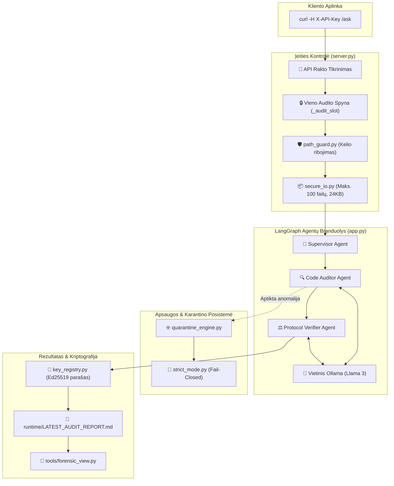

# 🌳 SafeStack Audit System — Projekto Architektūros Medis

Snapshot data: **2026-09-25**  
Organizacija: [`kibernetinio-saugumo-sprendimai`](https://github.com/kibernetinio-saugumo-sprendimai)  
Repozitorija: [`safestack-audit_system`](https://github.com/kibernetinio-saugumo-sprendimai/safestack-audit_system.git)  
Versija: **v1.0.0-GOLDEN**

---

## 📁 Pilna Repozitorijos Struktūra

```text
safestack-audit_system/
├── 📄 .gitignore                   # Git ignoruojami aplinkos ir laikini failai
├── 📄 AUDIT_OUTPUT_RULES.md        # 📋 Privalomos audito rezultatų ir radinių formatavimo taisyklės
├── 📄 AUDIT_REPORT.md              # 📄 Bazinė audito ataskaitos struktūra
├── 📄 AUDIT_REPORT_EN.md           # 🇬🇧 Oficiali audito ataskaita anglų kalba
├── 📄 DEPLOYMENT_RULES.md          # 🚀 Gamybinio diegimo taisyklės ir apribojimai
├── 📄 DEPLOYMENT_RULES_MINIMAL.md  # ⚡ Minimalios diegimo taisyklės edge aplinkoms
├── 📄 DEPLOYMENT_STANDARD_ENTERPRISE.md # 🏢 Korporatyvinis diegimo standartas
├── 📄 DETERMINISTIC_CONSTRAINED_INFRASTRUCTURE.md # 🧊 Ribotos deterministinės infrastruktūros modelis
├── 📄 GOLDEN_HASH_REGISTRY.json    # 🥇 Oficialus auksinis kontrolinių sumų (Golden Hashes) registras
├── 📄 GOVERNANCE_LAYER.md          # 🏛️ Valdysenos sluoksnio architektūra
├── 📄 IMPLEMENTATION_ROADMAP.md    # 🗺️ Projekto įgyvendinimo ir atnaujinimų gairės
├── 📄 QUARANTINE_PROTOCOL.md       # ☣️ Karantino vykdymo ir izoliuotų failų šalinimo protokolas
├── 📄 README.md                    # 📖 Pagrindinis sistemos manifestas ir paleidimo gidas
├── 📄 RELEASE_NOTES_v1.0.0-GOLDEN.md # 🏷️ v1.0.0 Golden leidimo aprašas ir patvirtinimas
├── 📄 SAFESTACK_AUDIT_AGENT_HIERARCHY.md # 👥 Agentų hierarchija (Supervisor, Auditor, Verifier)
├── 📄 SAFESTACK_AUDIT_AGENT_RULES.md     # 📐 Griežtos agentų elgesio ir kodo keitimo taisyklės
├── 📄 SAFESTACK_CANON_DEPLOYMENT.json    # 🏛️ Kanoninis suderinamumo ir diegimo registras
├── 📄 SHA256SUMS                   # 🔐 Visų failų SHA-256 kontrolinių sumų manifestas
├── 📄 TREE.md                      # 🌲 Šis projekto katalogų ir failų medis
├── 📄 VERSION                      # 🏷️ Versijos žyma (v1.0.0-GOLDEN)
├── 📄 app.py                       # 🤖 LangGraph deterministinis agentų darbo eigos variklis
├── 🔗 audit_system                 # 📦 Git submodulis (f16ea20) susietas su audito branduoliu
├── 📄 audit_tool.py                # 🔍 Kodo statinės ir dinaminės analizės CLI įrankis
├── 📄 canonical_serializer.py      # 📐 Deterministinis kanoninis JSON/duomenų serializatorius
├── 📄 isolated_rebuild_test.py     # 🔄 Švaraus izoliuoto perkonstravimo testas
├── 📄 key_registry.py              # 🔐 Ed25519 projektų ir Root pasirašymo raktų posistemė
├── 📄 oversight.md                 # 👁️ Žmogaus priežiūros (Human-in-the-Loop) doktrina
├── 📄 path_guard.py                # 🛡️ Griežta Path Traversal apsauga (tik SAFESTACK_AUDIT_ROOT ribose)
├── 📄 priority_1_replay_test.py    # 🔁 Replay atakų ir būsenos atkūrimo testas
├── 📄 priority_3_hash_chain_audit.py # 🔗 Kriptografinės maišos grandinės vientisumo testas
├── 📄 priority_4_immutability_test.py# 🧊 Nekintamumo (Immutability) užtikrinimo testas
├── 📄 priority_7_lockdown_test.py  # 🔒 Sistemos užrakinimo (Lockdown) testas
├── 📄 quarantine_engine.py         # ☣️ Pažeidžiamo kodo ir anomalijų izoliavimo / karantino variklis
├── 📄 requirements.txt             # 📋 Python priklausomybės (FastAPI, LangGraph, Cryptography)
├── 📄 secure_io.py                 # 📦 Riboto I/O valdiklis (maks. 100 failų, 24 KB limitai)
├── 📄 server.py                    # 🌐 FastAPI REST serveris (API raktų autorizacija, vienalaikiškumo spynos)
├── 📄 skill.md                     # 🧩 Agento įgūdžių ir iškvietimų specifikacija
├── 📄 sovereign_chaos_test.py      # 🌪️ Chaoso inžinerijos ir netikėtų trikdžių atsparumo testas
├── 📄 strict_mode.py               # 🚨 Fail-Closed griežtojo vykdymo taisyklių priverstinis taikymas
├── 📄 test_airgap.py               # 🔌 Airgap tinklo izoliacijos testas
├── 📄 test_airgap_full.py          # 🔌 Pilnas be-tinklio režimo testų paketas
├── 📄 test_api_auth.py             # 🔑 API raktų, antraščių ir autorizacijos testas
├── 📄 test_core.py                 # ⚙️ Branduolio funkcionalumo vienetų testai
├── 📄 test_deployment_cli.py       # 💻 Diegimo komandų eilutės sąsajos testas
├── 📄 test_direct.py               # 🎯 Tiesioginio agentų iškvietimo testas
├── 📄 test_key_registry.py         # 🔏 Ed25519 raktų generavimo, pasirašymo ir revokavimo testas
├── 📄 test_security_regressions.py # 🛡️ Žinomų saugumo spragų regresinis testas
│
├── 📂 .vscode/                     # 🛠️ Kūrimo Aplinka
│   └── 📄 tasks.json               # ⚙️ VS Code užduočių ir testų automatizavimas
│
├── 📂 governance/                  # 🏛️ Valdysenos Paketas
│   └── 📂 policy_bundle/           # Griežtųjų taisyklių rinkinys
│       ├── 📄 01_CAPABILITY_MODEL.md       # 🎯 DI agentų teisių, veiksmų ir prieigos ribų modelis
│       ├── 📄 02_RUNTIME_STATE_MACHINE.md  # 🔄 Deterministinės būsenų mašinos perėjimų taisyklės
│       ├── 📄 03_EVIDENCE_SPEC.md          # 📜 Įrodymų, radinių ir auditinių pėdsakų fiksavimo standartas
│       ├── 📄 04_06_CORE_POLICIES.md       # 🛡️ Bazinės saugumo, atminties ir resursų taisyklės
│       ├── 📄 07_10_INTEGRITY_POLICIES.md  # 🔒 Kriptografinio vientisumo ir nekintamumo garantijos
│       ├── 📄 11_15_CORE_SPECS.md          # ⚙️ Branduolio vykdymo ir izoliacijos specifikacijos
│       ├── 📄 11_TRUST_BOUNDARY_SPEC.md    # 🛑 Pasitikėjimo ribų (Trust Boundary) apibrėžimas
│       ├── 📄 16_20_GOVERNANCE_DOCTRINES.md# ⚖️ SafeStack valdysenos ir priežiūros doktrinos
│       ├── 📄 21_30_SOVEREIGN_SPECS.md     # 👑 Suverenios infrastruktūros ir nepriklausomumo standartai
│       ├── 📄 32_ENFORCEMENT_CORE.md       # 🔨 Taisyklių priverstinio vykdymo mechanizmai
│       ├── 📄 33_PROTOCOL_INTEGRITY_DOCTRINE.md # 🔗 Protokolo vientisumo ir atsparumo klastojimui doktrina
│       └── 📄 34_VERIFICATION_ERA_DIRECTIVE.md # 🏆 Verifikavimo eros ir kriptografinio tvirtinimo direktyva
│
└── 📂 tools/                       # 🔬 Teismo Ekspertizės Įrankiai
    └── 📄 forensic_view.py         # 🔍 Saugumo žurnalų ir įrodymų peržiūros CLI įrankis
```

---

## 🧩 Deterministinio Audito Veikimo Schema



---

## 📊 Repozitorijos Komponentų Suvestinė

- **Vykdymo Branduolys (`server.py`, `app.py`, `path_guard.py`, `quarantine_engine.py`):** FastAPI serveris su LangGraph agentų hierarchija, apsauga nuo Path Traversal ir karantino sistema.
- **Valdysenos Taisyklių Paketas (`governance/policy_bundle/`):** 12 griežtų kanoninių specifikacijų (agentų teisės, būsenų mašina, pasitikėjimo ribos).
- **Kriptografiniai & Chaoso Testai:** 14 testų rinkinių (Airgap izoliacija, Ed25519 raktų atšaukimas, nekintamumas, chaoso atsparumas).
- **Protokolai & Registrai:** `GOLDEN_HASH_REGISTRY.json`, `SAFESTACK_CANON_DEPLOYMENT.json`, `SHA256SUMS`.
